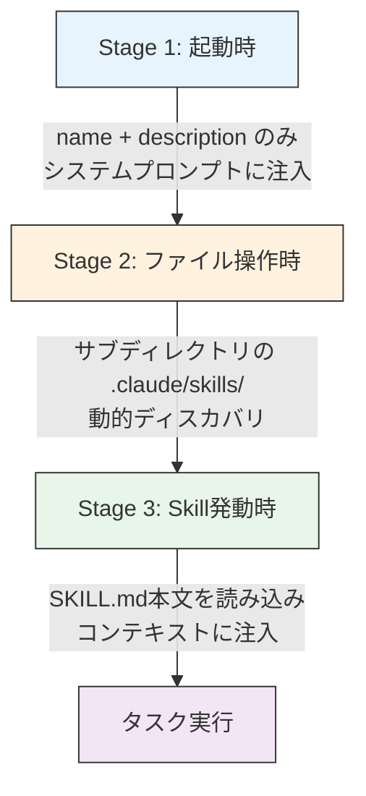

:::message
この記事は **2026年3月時点** の情報に基づいています。Claude Codeは活発に開発が進んでおり、仕様が変更される可能性があります。最新の公式ドキュメント（[code.claude.com/docs](https://code.claude.com/docs/en/skills)）を併せて確認してください。
:::

## この記事でわかること

- **CLAUDE.md と Skills の判断基準** ── 何をどこに書けばコンテキスト効率が最大化するか
- **Description Budget の具体的な数字** ── Skillを何個まで登録できるか、1つあたり何文字が最適か
- **モノレポにおけるネスト発見の設計パターン** ── サブディレクトリSkillsの自動ディスカバリと名前衝突の優先順位
- **compaction時にSkill情報が消える問題と対策** ── 長時間セッションでSkill手順を保持する方法
- **チーム配布・クロスエージェント互換** ── Cursor / Codex CLI との共有パターンとClaude Code固有拡張の扱い

---

## 導入

「CLAUDE.mdが200行を超えて、何が書いてあるか自分でも把握できない」── そんな状態になっていないでしょうか。

[Agent Skills](https://code.claude.com/docs/en/skills)は「専門知識のオンデマンドロード」を実現する仕組みです。必要なときだけSKILL.md本文を読み込むことで、CLAUDE.mdの肥大化を防ぎ、コンテキストウィンドウを効率的に使えます。しかし、設計を間違えるとdescriptionだけでbudgetを食い潰し、むしろコンテキストを圧迫します。

この記事では「何をSkillに切り出すか」「何個まで入れていいのか」「モノレポでどう配置するか」「compactionで何が消えるか」を**設計論**として整理します。作り方のチュートリアルではなく、実運用で直面する設計判断にフォーカスした内容です。

---

## 1. そもそも何をSkillに切り出すべきか

### CLAUDE.md vs Skills の判断基準

最初に整理すべきは「何をCLAUDE.mdに残し、何をSkillに分離するか」です。判断の軸は**頻度**と**分量**の2つです。

| 基準 | CLAUDE.mdに残す | Skillに分離する |
|---|---|---|
| **適用頻度** | 全タスクで常に適用 | 特定タスクでのみ使用 |
| **分量** | 10〜40行程度 | 100行超の手順書 |
| **具体例** | コーディング規約、パッケージマネージャ指定、テストコマンド、ブランチ命名規則 | PDF操作手順、デプロイフロー、ドキュメント生成テンプレート、DB移行手順 |
| **コンテキスト消費** | 毎セッション全文読み込み | descriptionのみ常時ロード（30〜100トークン） |
| **付随ファイル** | なし | スクリプトやテンプレートを伴う場合あり |

参照: [How Claude Code works](https://code.claude.com/docs/en/how-claude-code-works), [Skills公式ドキュメント](https://code.claude.com/docs/en/skills)

### 原則:「CLAUDE.mdは短く、Skillsは深く」

[CLAUDE.mdは毎セッション全文が読み込まれます](https://code.claude.com/docs/en/how-claude-code-works)。一方、Skillsはdescription（30〜100トークン）だけが常時ロードされ、本文はオンデマンドで読み込まれます。つまり:

- **CLAUDE.md**: 常にコンテキストを消費するので短く保ちます
- **Skills**: 使わない限りdescriptionしか消費しないので、長い手順書を入れても問題ありません

### `/init` の出力は削るべき

`/init` コマンドが生成するCLAUDE.mdは、リポジトリ構造を網羅的に記述するため冗長になりがちです。生成後に以下を削ることを推奨します:

- ディレクトリ構造の全量リスト（Claudeはファイルを自分で読めます）
- 各ファイルの説明文（Claudeはコードから理解できます）
- 技術スタックの詳細バージョン（package.jsonから読めます）

残すべきは「Claudeが自力では判断できない、プロジェクト固有の意思決定」だけです。

---

## 2. Agent Skillsの3段階ロード

Skillsのロードは3段階で行われます。この仕組みを理解することが設計の起点になります。



参照: [Skills公式ドキュメント](https://code.claude.com/docs/en/skills), [Agent Skills Overview](https://platform.claude.com/docs/en/agents-and-tools/agent-skills/overview)

### Stage 1: 起動時 ── descriptionの一括ロード

セッション開始時に、すべてのSkillの`name`と`description`がシステムプロンプトにロードされます。**SKILL.md本文は読まれません。** これがトークン節約の核心です。

### Stage 2: ファイル操作時 ── ネスト発見

プロジェクトルートでセッションを開始した場合、サブディレクトリの`.claude/skills/`は**未ロード**の状態です。そのディレクトリ内のファイルにアクセスした時点で、追加のSkillがディスカバリされます。

```text
# rootでsession開始 → この時点ではrootの.claude/skills/のみ認識

packages/frontend/src/App.tsx を編集
  ↓
# packages/frontend/.claude/skills/ が自動ディスカバリ
# name + description がシステムプロンプトに追加
```

### Stage 3: Skill発動時 ── 本文の読み込み

ユーザーの入力に対し、Claudeがdescriptionに基づいて「このSkillが必要だ」と判断すると、SKILL.md本文を読み込んでコンテキストに注入します。インターフェースには`Reading [skill-name]`と表示されます。

### ルーティング判断の仕組み

:::message alert
以下はアーキテクチャ的に妥当な説明ですが、Anthropicが公式にこの通り説明しているわけではありません。技術的な理解としての記述です。
:::

Skillの発動判断は、if-elseのルールエンジンではなく、**LLMのforward pass（推論プロセス）の中で行われます**。ユーザー入力とSkill descriptionの意味的関連度がニューラルネットの推論として評価されます。

だからこそ、descriptionには**ユーザーが使いそうな言葉（トリガーワード）を含める**ことが重要です。「このSkillはPDFを生成するときに使う」なら、descriptionに`PDF`, `generate`, `レポート`, `出力` などのキーワードを盛り込みます。

---

## 3. Description Budgetのリアル

### 2%ルールと16,000文字フォールバック

Skill descriptionの合計は、**コンテキストウィンドウの2%で動的にスケール**します。フォールバック値は**16,000文字**です。環境変数`SLASH_COMMAND_TOOL_CHAR_BUDGET`でオーバーライドもできます。

参照: [Skills公式ドキュメント](https://code.claude.com/docs/en/skills), [GitHub Issue #13099](https://github.com/anthropics/claude-code/issues/13099)

### 1 Skillあたりの消費量

各Skillは以下のトークンを消費します:

```text
消費文字数 = description の文字数 + 約109文字（XMLオーバーヘッド）
```

この109文字はSkillのメタデータ（nameタグ、descriptionタグ等）に使われる固定コストです（[alexey-pelykh氏による実測](https://github.com/anthropics/claude-code/issues/13099)）。

### 何個まで大丈夫か ── 具体的な計算

16,000文字のbudgetを前提に計算します:

| Skill数 | description上限（推奨） | 計算式 | budgetに収まるか |
|---|---|---|---|
| 20個 | 300文字 | (300 + 109) × 20 = 8,180 | 余裕あり |
| 40個 | 150文字 | (150 + 109) × 40 = 10,360 | 収まる |
| 60個 | 130文字 | (130 + 109) × 60 = 14,340 | ギリギリ |
| 80個 | 90文字 | (90 + 109) × 80 = 15,920 | ギリギリ |
| 100個 | 50文字 | (50 + 109) × 100 = 15,900 | 収まるが実用的でない |

**実例**: 63個のSkillをインストールした環境で、42個しか表示されず**21個（33%）が隠れた**事例が報告されています（[GitHub Issue #13099](https://github.com/anthropics/claude-code/issues/13099)）。

### descriptionの書き方ベストプラクティス

| ポイント | 詳細 |
|---|---|
| **文字数** | 60個以上なら130文字以下、40〜60個なら150文字以下 |
| **トリガーワードを前方に** | 最初の50文字にユーザーが使いそうなキーワードを集中させる |
| **具体的に** | 「便利なスキル」ではなく「TypeScriptのZodスキーマからOpenAPIのYAMLを生成する」 |
| **XMLタグ不可** | descriptionにXMLタグを含めるとパースエラーになる |

### Frontmatter制約

[公式のベストプラクティス](https://platform.claude.com/docs/en/agents-and-tools/agent-skills/best-practices)による制約:

- **name**: 最大64文字、小文字英数字+ハイフンのみ、XMLタグ不可
- **description**: 最大1,024文字、空不可、XMLタグ不可

---

## 4. モノレポ × ネスト発見の設計パターン

### ネスト発見（Nested Skills Discovery）の仕組み

プロジェクト内の`.claude/skills/`ディレクトリは、**ネストされたサブディレクトリでも自動ディスカバリされます**。これはCHANGELOGで「Added automatic discovery of skills from nested .claude/skills directories」として追加された機能です。

参照: [Skills公式ドキュメント](https://code.claude.com/docs/en/skills)

### トリガータイミング

ネスト発見が発動するのは、**そのサブディレクトリ内のファイルにアクセスしたとき**です。

```text
monorepo/
├── .claude/skills/          ← Stage 1 で即ロード
│   └── coding-standards/SKILL.md
├── packages/
│   ├── frontend/
│   │   ├── .claude/skills/  ← frontend/ のファイルにアクセスするまで未ロード
│   │   │   └── react-patterns/SKILL.md
│   │   └── src/
│   ├── backend/
│   │   ├── .claude/skills/  ← backend/ のファイルにアクセスするまで未ロード
│   │   │   └── api-design/SKILL.md
│   │   └── src/
│   └── shared/
│       └── src/
```

この設計はモノレポと相性が良いです。各パッケージチームが自分のSkillsを管理でき、他パッケージのSkillsがbudgetを消費しません。

### `~/.claude/skills/` の制限事項

:::message alert
`~/.claude/skills/`（ユーザースキル）は**再帰スキャンされません**。フラット構造が必須であり、サブディレクトリにSKILL.mdを配置しても発見されません。この制限は[GitHub Issues #18192](https://github.com/anthropics/claude-code/issues/18192), [#16438](https://github.com/anthropics/claude-code/issues/16438), [#20805](https://github.com/anthropics/claude-code/issues/20805)で複数回Feature Requestされていますが、2026年3月時点で未実装です。

回避策として、シンボリックリンクでフラット化する方法があります:
:::

```bash
# ~/.claude/skills/ をフラット構造に保ちつつ、
# 実体は別ディレクトリで管理する例
ln -s ~/my-skills/deploy/SKILL.md ~/.claude/skills/deploy/SKILL.md
ln -s ~/my-skills/pdf-gen/SKILL.md ~/.claude/skills/pdf-gen/SKILL.md
```

### Skill名の衝突時の優先順位

同名のSkillが複数の階層に存在する場合、以下の優先順位で解決されます（[公式ドキュメント](https://code.claude.com/docs/en/skills)）:

```text
優先度: 高 ──────────────────────────── 低

1. プロジェクト (.claude/skills/)      ← 最優先
2. ユーザー (~/.claude/skills/)
3. プラグイン (plugin-name:skill-name) ← 名前空間が分離
```

- **プラグイン**はプレフィックス付き（`plugin-name:skill-name`）なので実質衝突しません
- **ネスト発見**で追加されたSkillは、上位ディレクトリのSkillと名前が衝突する場合、上位が優先されます

推奨ディレクトリ構成:

```text
monorepo/
├── .claude/
│   └── skills/
│       ├── shared-conventions/SKILL.md  ← 全パッケージ共通
│       └── ci-pipeline/SKILL.md
├── packages/
│   ├── frontend/
│   │   └── .claude/skills/
│   │       └── component-gen/SKILL.md   ← frontend固有
│   └── backend/
│       └── .claude/skills/
│           └── migration/SKILL.md       ← backend固有
```

---

## 5. Skill × Subagent のコンテキスト制御

:::details Skill × Subagent のコンテキスト制御（詳細）

Skillsとサブエージェントの組み合わせには3つの制御方法があります。それぞれの挙動とユースケースを整理します。

### 3つの制御方法の比較

| 制御方法 | 動作 | コンテキスト消費 | ユースケース |
|---|---|---|---|
| `context: fork` | Skillが別のコンテキストウィンドウで実行。mainには要約のみ返却 | mainを消費しない | 大量のファイル操作、長い手順の実行 |
| subagentの`skills`フィールド | 指定したSkillの**全文がsubagent起動時に注入**される | subagentのコンテキストを消費 | subagentに専門知識を持たせる |
| `disable-model-invocation: true` | Claudeが自動発動しない。`/skill-name`でのみ起動 | descriptionは常時ロードされる | 危険な操作（deploy等）のガード |

### `context: fork` の挙動

[公式ドキュメント](https://code.claude.com/docs/en/sub-agents)によると、`context: fork`を指定したSkillは**別のコンテキストウィンドウ**で実行されます。main agentのコンテキストには要約のみが返るため、main contextを消費しません。

```yaml
---
name: heavy-analysis
description: 大規模なコードベース分析を実行する
context: fork
---
```

:::message alert
[GitHub Issue #17283](https://github.com/anthropics/claude-code/issues/17283)で「Skillツール経由で呼ぶとforkが無視される」バグが報告されています。使用するClaude Codeのバージョンで動作確認を推奨します。
:::

### subagentの `skills` フィールド

[subagent公式ドキュメント](https://code.claude.com/docs/en/sub-agents)に明記されている重要な仕様があります:

> The full content of each skill is injected into the sub-agent's context, not just made available for invocation

つまり、subagentの`skills`フィールドに指定したSkillは**遅延ロード（description → 本文）ではなく、全文が起動時からsubagentに注入**されます。また、subagentは親の会話からSkillsを継承しません。明示的に`skills:`で列挙する必要があります。

### `disable-model-invocation: true` の効果

[公式ドキュメント](https://code.claude.com/docs/en/skills)によると、このフラグを付けたSkillは、Claudeが自動発動しません。ユーザーの`/skill-name`コマンドでのみ起動します。

実質的に「descriptionを自動ルーティングの対象から外す」スイッチとして機能します。

```yaml
---
name: deploy-production
description: プロダクション環境へのデプロイを実行する
disable-model-invocation: true
---
```

**有効なユースケース:**
- 危険な操作（deploy, force-push, DB migration等）
- 特定のsubagentからのみ使いたいSkill
- テスト中で意図せず発動させたくないSkill

### モノレポでの推奨構成例

```text
monorepo/
├── .claude/skills/
│   ├── deploy-staging/SKILL.md     ← disable-model-invocation: true
│   └── code-review/SKILL.md       ← context: fork（大量差分を扱うため）
├── packages/frontend/
│   └── .claude/skills/
│       └── component-gen/SKILL.md  ← 通常のSkill
└── packages/backend/
    └── .claude/skills/
        └── api-scaffold/SKILL.md   ← subagentのskillsで指定して使う
```

:::

---

## 6. MCP Tool Searchとの対比 ── なぜSkillsにはlazy loadingがないのか

:::details MCP Tool Searchとの対比（詳細）

### MCP Tool Searchの仕組み

[MCP公式ドキュメント](https://code.claude.com/docs/en/mcp)および[Tool Search Tool](https://platform.claude.com/docs/en/agents-and-tools/tool-use/tool-search-tool)によると、MCPツールには`defer_loading`による遅延ロードの仕組みがあります。

```text
MCP Tools（defer_loading有効時）:
  起動時 → ツール名のインデックスのみロード
  必要時 → Tool Search Toolでツール定義をフルロード

  50ツール × ~1,100tok/ツール = ~55,000tok
  → Tool Searchで ~5,000tok に（85%削減）
```

### Skillsに適用されない理由

Skillsには`defer_loading`は**適用されません**。これは明確に別レイヤーとして設計されています（[alexey-pelykh氏の分析](https://github.com/anthropics/claude-code/issues/13099)）。

理由は**規模感の違い**にあります:

| 項目 | MCP Tools | Skills |
|---|---|---|
| 1つあたりの常時コスト | ~1,100トークン | ~100トークン（description + XML） |
| 典型的な数 | 50〜200+ | 10〜60 |
| 常時消費量 | 55,000tok（深刻） | 3,000tok（許容範囲） |
| 遅延ロードの必要性 | 高い | 現状は低い |

### 将来的に必要になるシナリオ

ただし、プラグインエコシステムの拡大により、Skillが100個を超える環境が現れれば、同様の仕組みが必要になる可能性はあります。現時点では、description budgetの最適化（セクション3参照）で対処可能です。

:::

---

## 7. compactionの罠 ── Skill手順は消える

長時間のセッションで避けて通れないのが**compaction**です。コンテキストウィンドウが限界に達すると、Claude Codeは会話を要約して圧縮します。このとき、**SKILL.md本文の手順は消失します**。

参照: [GitHub Issue #13919](https://github.com/anthropics/claude-code/issues/13919), [GitHub Issue #20466](https://github.com/anthropics/claude-code/issues/20466), [How Claude Code works](https://code.claude.com/docs/en/how-claude-code-works)

### 何が保持され、何が消えるか

| 項目 | compaction後の状態 | 理由 |
|---|---|---|
| CLAUDE.md | **保持される** | ディスクから再読み込みされるため |
| Skill一覧（name + description） | **保持される** | システムプロンプトの一部として再注入 |
| SKILL.md本文の手順 | **消失する** | 会話コンテキスト内にあるため要約で消える |
| system-reminderのSkill名 | **保持される** | ただし具体的手順は含まれない |
| ファイル編集の履歴 | **要約される** | 詳細は消え、概要のみ残る |

### 実際に報告されている問題

- **[Issue #13919](https://github.com/anthropics/claude-code/issues/13919)**: compaction後にSkillの手順を完全に忘れ、同じタスクを最初からやり直す事例が詳細に報告されています
- **[Issue #20466](https://github.com/anthropics/claude-code/issues/20466)**: 逆にcompaction後にSkillを再実行してしまう（終わったタスクをもう一度やる）バグも報告されています

### 対策

**対策1: CLAUDE.mdに「Compact Instructions」セクションを設ける**

```markdown
## Compact Instructions

compaction後、以下のSkillを使用中だった場合は本文を再読み込みすること:
- deploy-production: /deploy-production で再読み込み
- api-scaffold: SKILL.mdを再度catして手順を確認
```

CLAUDE.mdはcompaction後もディスクから再読み込みされるため、この指示は保持されます。

**対策2: 手動 `/compact` でフォーカスを指定する**

自動compactionに任せるのではなく、手動で`/compact`を実行し、何を残すかを意図的にコントロールします。重要な作業コンテキストがあるときは、compaction前に要点をCLAUDE.mdやメモファイルに書き出す運用も有効です。

**対策3: `context: fork` で長い作業を分離する**

Skill実行を`context: fork`で別コンテキストに分離すれば、main contextの圧迫を防ぎ、compactionの頻度そのものを下げられます。

---

## 8. チーム運用とクロスエージェント互換

:::details チーム運用とクロスエージェント互換（詳細）

### チーム配布の3つの方法

参照: [Skills公式ドキュメント](https://code.claude.com/docs/en/skills), [anthropics/skills リポジトリ](https://github.com/anthropics/skills)

| 方法 | スコープ | 配布方法 | 適したケース |
|---|---|---|---|
| **プロジェクトSkill** (`.claude/skills/`) | リポジトリ内 | git commitするだけ | チーム内共有。最もシンプル |
| **ユーザーSkill** (`~/.claude/skills/`) | 個人のマシン | 手動配置 or dotfiles管理 | 個人のクロスプロジェクト用 |
| **プラグイン** | 組織横断 | `plugin.json`を含むリポジトリを登録 → `/plugin marketplace add <repo>` | 複数リポジトリでの横断配布 |
| **Managed Settings** | Enterprise組織 | 組織管理者が一括配布 | 全社的なガバナンスルール |

**使い分けの原則:**
- プロジェクトSkill → そのリポジトリ固有のナレッジをチームで共有
- ユーザーSkill → 個人の作業効率化（全プロジェクトで使う汎用スキル）
- プラグイン → 組織のベストプラクティスを横断配布

### クロスエージェント互換性

Agent Skillsは2025年12月にAnthropicが**オープンスタンダード**としてリリースしました（[agentskills.io](https://agentskills.io)）。同じSKILL.md形式が以下のツールでもサポートされています:

- Claude Code（本家）
- OpenAI Codex CLI
- Cursor
- GitHub Copilot
- Gemini CLI
- Antigravity IDE 等

参照: [Skills公式ドキュメント](https://code.claude.com/docs/en/skills), [atama plus社の記事](https://zenn.dev/atamaplus/articles/6d8c3615ff3f33)

### Claude Code固有拡張の注意点

ただし、以下のfrontmatterフィールドはClaude Code固有の拡張であり、他ツールではサポートされない場合があります:

```yaml
# Claude Code固有 ── 他ツールでは無視される可能性が高い
context: fork
agent: <agent-name>
allowed-tools: [Bash, Read, Write]
disable-model-invocation: true
```

**ポータブルにしたい場合は、frontmatterを`name`と`description`のみに留めるのが安全です。**

### マルチエージェント共有パターン

複数のエージェントツール間でSkillsを共有する場合、シンボリックリンクが有効です（[atama plus方式](https://zenn.dev/atamaplus/articles/6d8c3615ff3f33)）:

```bash
# 実体を1箇所で管理
mkdir -p ./shared-skills/component-gen

# 各ツールのSkillsディレクトリにシンボリックリンク
ln -s ../../shared-skills/component-gen .claude/skills/component-gen
ln -s ../../shared-skills/component-gen .codex/skills/component-gen
ln -s ../../shared-skills/component-gen .cursor/skills/component-gen
```

この方法なら、Skillの更新を1箇所で行えば全ツールに反映されます。ただしClaude Code固有のfrontmatter（`context: fork`等）はportableなSKILL.mdには含めず、Claude Code専用のSkillとして別途管理することを推奨します。

:::

---

## 9. デバッグ・トラブルシューティング

### 主要なデバッグコマンド

参照: [Skills公式ドキュメント](https://code.claude.com/docs/en/skills), [How Claude Code works](https://code.claude.com/docs/en/how-claude-code-works)

| コマンド | 用途 |
|---|---|
| `/context` | 何がどれだけトークンを消費しているか一覧表示。budget超過警告もここに出る。検索フィルタ機能あり（v2.1.6〜） |
| `/skills` | 現在ディスカバリされているSkillの一覧表示 |
| `/doctor` | MCPを含むツール全体の状態確認 |
| `Ctrl+O` | トランスクリプトモード。thinking blocksやツール呼び出しをリアルタイムで確認 |

### `/context` の出力例

`/context`を実行すると、コンテキストウィンドウ内の各要素のトークン消費量が一覧表示されます。Skillsのbudget超過が発生している場合は、以下のような警告が表示されます:

```text
Context breakdown:
  System prompt:        12,450 tokens
  CLAUDE.md:             1,200 tokens
  Skills (descriptions): 3,800 tokens  ⚠ Showing 42 of 63 skills due to token limits
  Conversation:         45,000 tokens
  Tool results:          8,500 tokens
  ─────────────────────────────
  Total:                70,950 tokens
```

<!-- TODO: /context のスクリーンショット -->

`Showing 42 of 63 skills due to token limits`という警告が出たら、descriptionの文字数を削減するか、不要なSkillを削除する必要があります。

### 「Skillが発動しない」ときの確認手順

```text
1. /skills で一覧に表示されているか確認
   → 表示されていない場合:
     - ファイルパスが正しいか（.claude/skills/<name>/SKILL.md）
     - frontmatterの形式が正しいか（name, description必須）
     - ネスト発見のトリガー（そのディレクトリのファイルにアクセスしたか）

2. /context でbudgetから溢れていないか確認
   → 「Showing N of M skills」が出ている場合:
     - descriptionを短くする
     - 不要なSkillを削除またはdisable-model-invocation: trueに

3. descriptionにトリガーワードが含まれているか確認
   → ユーザー入力との意味的関連度が低いと発動しない
   → description冒頭にキーワードを集中させる

4. disable-model-invocation: true が意図せず設定されていないか確認
   → この場合、/skill-name でのみ起動する
```

### `Ctrl+O` でSkill発動の様子を観察

トランスクリプトモード（`Ctrl+O`）を有効にすると、ClaudeがSkillを発動する過程をリアルタイムで確認できます。`Reading [skill-name]`のログが表示されれば、SKILL.md本文が読み込まれている証拠です。発動の有無が不明な場合はここで確認してください。

---

## 10. 設計チェックリスト

記事の内容を実践的なチェックリストにまとめました。新しいSkillを追加するとき、チーム導入時、トラブル発生時に使ってください。

### Skill設計時

- [ ] CLAUDE.mdに残す内容は「全タスクで常に適用されるルール」のみに絞っているか
- [ ] 100行超の手順書はSkillに分離しているか
- [ ] `/init`生成のCLAUDE.mdから冗長な記述（ディレクトリ全量リスト等）を削除したか

### Description最適化

- [ ] descriptionの文字数は登録Skill数に応じた上限以下か（60個以上→130文字以下、40〜60個→150文字以下）
- [ ] descriptionの冒頭50文字にトリガーワードを集中させているか
- [ ] frontmatterにXMLタグを含めていないか
- [ ] `/context`でbudget超過警告（`Showing N of M skills`）が出ていないか

### モノレポ配置

- [ ] プロジェクトルートの`.claude/skills/`にはリポジトリ共通のSkillのみ配置しているか
- [ ] 各パッケージ固有のSkillはそのパッケージの`.claude/skills/`に配置しているか
- [ ] Skill名の衝突がないか確認したか（上位ディレクトリが優先される）
- [ ] `~/.claude/skills/`はフラット構造になっているか（サブディレクトリの再帰スキャンは未対応）

### コンテキスト制御

- [ ] 大量のファイル操作を伴うSkillには`context: fork`を指定しているか
- [ ] 危険な操作（deploy等）のSkillには`disable-model-invocation: true`を設定しているか
- [ ] subagentの`skills`フィールドに指定するSkillは、全文注入されることを理解しているか
- [ ] subagentに親のSkillsは継承されないことを理解しているか

### compaction対策

- [ ] CLAUDE.mdに「Compact Instructions」セクションを設けているか
- [ ] 長時間セッションでは手動`/compact`でフォーカスを指定しているか
- [ ] `context: fork`で長い作業を分離し、compaction頻度を下げているか

### チーム配布

- [ ] チーム共有Skillは`.claude/skills/`でgit管理しているか
- [ ] 組織横断配布にはプラグイン化を検討したか
- [ ] クロスエージェント互換を考慮する場合、frontmatterを`name`+`description`のみに留めているか
- [ ] マルチエージェント共有にはシンボリックリンクを活用しているか

### デバッグ

- [ ] `/skills`で一覧に表示されることを確認したか
- [ ] `/context`でトークン消費量を確認したか
- [ ] `Ctrl+O`（トランスクリプトモード）で`Reading [skill-name]`が出ることを確認したか
- [ ] `/doctor`でツール全体の状態に問題がないか確認したか

---

## 参考リンク

### 公式ドキュメント

- [Claude Code Skills](https://code.claude.com/docs/en/skills)
- [Agent Skills Overview (Platform)](https://platform.claude.com/docs/en/agents-and-tools/agent-skills/overview)
- [Agent Skills Best Practices](https://platform.claude.com/docs/en/agents-and-tools/agent-skills/best-practices)
- [How Claude Code Works](https://code.claude.com/docs/en/how-claude-code-works)
- [Sub-agents](https://code.claude.com/docs/en/sub-agents)
- [MCP](https://code.claude.com/docs/en/mcp)
- [Tool Search Tool](https://platform.claude.com/docs/en/agents-and-tools/tool-use/tool-search-tool)
- [Agent Skills Open Standard](https://agentskills.io)

### GitHub Issues

- [#13099 - Description budget and skill visibility](https://github.com/anthropics/claude-code/issues/13099)
- [#13919 - compaction後にSkill手順を忘れる](https://github.com/anthropics/claude-code/issues/13919)
- [#17283 - context: fork がSkillツール経由で無視される](https://github.com/anthropics/claude-code/issues/17283)
- [#18192 - ~/.claude/skills/ の再帰スキャン要望](https://github.com/anthropics/claude-code/issues/18192)
- [#16438 - ユーザーSkillsのサブディレクトリサポート](https://github.com/anthropics/claude-code/issues/16438)
- [#20466 - compaction後にSkillが再実行される](https://github.com/anthropics/claude-code/issues/20466)
- [#20805 - ユーザーSkillsのネスト発見](https://github.com/anthropics/claude-code/issues/20805)

### 関連リポジトリ

- [anthropics/skills](https://github.com/anthropics/skills) - 公式Skillsコレクション

### 参考記事

- [atama plus: Agent Skillsのマルチエージェント共有](https://zenn.dev/atamaplus/articles/6d8c3615ff3f33)

---

*著者: [syurekku13](https://zenn.dev/syurekku13) / PoliPoli*
